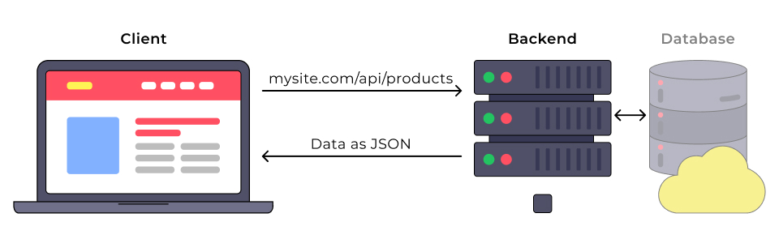

# HTTP-запити і взаємодія з бекендом

###### [to main page](../js_main.md)

## Інтернет і протоколи

### Протокол HTTP

Перед тим як користувач побачить вміст сайту на екрані, браузер робить запит на
сервер, щоб отримати цей вміст. HTML-файл, зображення, стилі та скрипти — усе це
приходить із сервера за HTTP протоколом. HTTP протокол, по суті, є набором
правил і домовленостей, що використовуються при передачі даних у мережі.


**HyperText Transfer Protocol (протокол передачі гіпертексту)** — поширений
протокол для передачі вебресурсів різних типів: html, css, javascript,
зображень, аудіо та відео тощо.

HTTP ґрунтується на структурі **клієнт-сервер** і моделі **запит-відповідь**.

Як це працює?

1. Клієнтський застосунок ініціює з'єднання, формує запит і відправляє його на
   сервер.
2. Після чого сервер обробляє цей запит, формує відповідь і передає її назад
   клієнтові.
3. Зв'язок між ними здійснюється за допомогою низки перемежованих HTTP-запитів і
   HTTP-відповідей.


Запит відбувається в кілька етапів:

-   **DNS-запит** — пошук найближчого DNS-сервера, щоб перетворити адресу
    (наприклад `google.com`) в її числове вираження, IP-адресу (74.125.87.99).
-   `З'єднання` — встановлення з'єднання з сервером за отриманою IP-адресою.
-   `Передача даних` — пересилання пакетів з клієнта на сервер.
-   `Очікування відповіді` — очікування, доки пакети даних дійдуть до сервера,
    він їх обробить, і відповідь повернеться назад до клієнта.
-   `Отримання даних` — пакети надійшли, можна отримувати з них дані.

### Протокол HTTPS

**HyperText Transfer Protocol Secure** — це налаштування над протоколом HTTP, у
якому всі повідомлення між клієнтом і сервером шифруються з метою підвищення
безпеки.

HTTPS протокол забезпечує захист від атак, що базуються на “прослуховуванні”
з'єднання. Дані передаються з використанням криптографічних протоколів SSL або
TLS.


Під час обміну через звичайне HTTP-з'єднання всі дані передаються у вигляді
тексту і можуть бути прочитані всіма, хто отримав доступ до з'єднання між
клієнтом і сервером. Якщо користувачі роблять покупки онлайн і заповнюють форму
замовлення, що містить інформацію про кредитну картку, їхні фінансові дані
набагато легше викрасти, якщо вони передаються у вигляді тексту. З HTTPS дані
будуть зашифровані і хакер не зможе їх розшифрувати, тому що для розшифрування
необхідний доступ до закритого ключа, який зберігається на сервері.

Протокол HTTPS гарантує, що інформація про клієнта, наприклад номери кредитних
карток, зашифрована і не може бути перехоплена в розшифрованому вигляді.
Відвідувачі можуть переконатися, що сайт безпечний, подивившись на іконку зліва
від адресного рядка, захищені з'єднання позначаються іконкою замка.

## HTTP-запити

**Сервер** — це комп'ютер зі спеціальним програмним забезпеченням.

**Бекенд** — це програма, розташована на сервері, яка здатна обробити вхідні
HTTP-запити і має набір готових дій на певні запити.


**API (інтерфейс прикладного програмування)** — набір чітко визначених правил
зв'язку між різними програмними компонентами. Інтерфейс описує, що можна
попросити програму зробити і що буде в результаті.

**REST (representational state transfer)** — стиль бекенд-архітектури. Він
ґрунтується на наборі принципів, які описують, яким чином визначаються й
адресуються мережеві ресурси.

**REST API** — бекенд побудований за принципом REST. Слугує прошарком між
вебзастосунком і базою даних. Має стандартний інтерфейс для звернення до
ресурсів. Працює як вебсайт, ми посилаємо HTTP-запит із клієнта на сервер, а у
відповідь, замість HTML-сторінки, отримуємо дані в JSON-форматі.

Існують тисячі бекендів, і кожен з них унікальний. З іншого боку, REST API
побудовані за стандартною архітектурою. Отже, можна зрозуміти принцип їх роботи,
після чого все, що потрібно зробити — це ознайомитися з документацією того
бекенду, який необхідно використовувати.

### Шлях до ресурсу

Запити на бекенд повинні містити шлях до ресурсу, над яким виконується операція.
Доступні шляхи (ендпоінти, ресурси) описуються в документації бекенду.

**Ендпоінти (англ. endpoints) в контексті вебсервісів та API** — це конкретні
URL-адреси, через які можна отримати доступ до певних функцій або ресурсів
сервера. Вони служать точками входу для взаємодії між клієнтом і сервером,
дозволяючи отримувати, надсилати, оновлювати чи видаляти дані.

Давай розберемо це на прикладі JSONPlaceholder API. Це публічний REST API для
швидкого прототипування, який надає кілька різних колекцій уявних даних.

```js
<https://jsonplaceholder.typicode.com/users>
```

Такий шлях (ендпоінт) явно вказує на ресурс, навіть якщо ми його ніколи раніше
не бачили. Такий URL шлях є ієрархічним і описовим. Ми виконуємо запит на REST
API для отримання ресурсу `/users`.

Цей шлях складається з таких частин:

-   `https://jsonplaceholder.typicode.com` — це базовий URL, точка входу в API.
-   `/users` — ресурс, до якого звертаємося.

Візьми і встав цей шлях в адресний рядок браузера та перейди за ним.

Браузер виконає HTTP-запит, але замість HTML-файлу у відповіді прийде JSON з
даними, який відобразиться у вкладці як звичайний текст (див. схему).



### Fetch API

Fetch API — це інтерфейс, який вбудований у браузер і доступний через об'єкт
`window`. Він надає набір властивостей і методів, які дозволяють відправляти,
отримувати та обробляти ресурси із сервера.

Метод `fetch()` надає сучасний інтерфейс для формування запитів до сервера і
побудований на промісах.

```js
fetch(url, options);
```

-   `url` — шлях до даних на бекенді, які необхідно отримати, створити або
    змінити. **Обов'язковий аргумент**.
-   `options` — об'єкт налаштувань запиту: метод, заголовки, тіло тощо.
    **Необов'язковий аргумент**.

`JSONPlaceholder API` — це вебсервіс, який містить декілька ресурсів
(користувачів, продуктів тощо).

У прикладі нижче будемо робити запит до нашого вебсервісу, щоб отримати колекцію
користувачів (ресурс `/users`).

```js
fetch('<https://jsonplaceholder.typicode.com/users>')
    .then(response => {
        // Response handling
    })
    .then(data => {
        // Data handling
    })
    .catch(error => {
        // Error handling
    });
```

Метод `fetch` повертає проміс, тому до результату його виклику додаємо ланцюжок
методів `then()` і `catch()` для обробки відповіді.

### Вкладка Network

В інструментах розробника на вкладці `Network` (укр. “Мережа”) відображаються
всі HTTP-запити, що виконуються на сторінці. Їх може бути корисно переглянути у
разі, коли розробнику потрібно перевірити деталі запиту на бекенд.

Як це зробити?

1. Вибери фільтр асинхронні HTTP/HTTPS-запити, зроблені за допомогою Fetch API
   або XMLHttpRequest, `XHR` або `Fetch/XHR` — так залишаться тільки асинхронні
   HTTP/HTTPS-запити, зроблені за допомогою Fetch API або XMLHttpRequest.
2. Після запуску скрипта з викликом методу `fetch`, через деякий час запит
   відобразиться у списку.
3. Вибери цей запит, щоб подивитися всю інформацію по ньому на підвкладках
   `Headers` (укр. “Заголовки”), `Preview` (укр. “Попередній перегляд”) і
   `Response` (укр. “Відповідь”).


## Коди відповідей

На запит клієнта сервер відправляє відповідь, яка містить код стану, щоб
інформувати клієнта про результат операції.

Код відповіді можна подивитися на вкладці `Network` у полі `Status Code`.


Коди діляться на групи залежно від того, з якої цифри починається код помилки.

-   **1XX** — мають інформаційне призначення
-   **2XX** — коди успішного проведення операції
-   **3XX** — описують усе, що пов'язано з перенаправленням (redirect)
-   **4XX** — вказують на помилки з боку клієнта
-   **5XX** — вказують на помилки з боку сервера

Немає потреби пам'ятати всі коди з кожної групи, достатньо знати найпоширеніші.
Решту завжди можна подивитися в довіднику HTTP-кодів.

-   **200 (OK)** — стандартна відповідь для успішних HTTP-запитів.
-   **201 (Created)** — стандартна відповідь для HTTP-запиту, який привів до
    успішного створення ресурсу.
-   **400 (Bad Request)** — запит не може бути оброблений через неправильний
    синтаксис запиту або іншу помилку клієнта.
-   **401 (Unauthorized)** — для доступу до ресурсу вимагається авторизація.
-   **403 (Forbidden)** — у клієнта немає дозволу на доступ до цього ресурсу.
-   **404 (Not Found)** — у цей час ресурс не знайдений. Можливо, він був
    видалений або ще не існує.
-   **500 (Internal Server Error)** — загальна відповідь на непередбачений збій
    сервера, якщо відсутня конкретніша інформація.

### Перевірка відповіді

Значення промісу, який повертає метод `fetch()` — це об'єкт зі службовою
інформацією про стан відповіді сервера. Цей об’єкт є екземпляром класу
`Response`, який включає різні методи та властивості. Залежно від типу
отримуваного контенту, використовуються різні методи для перетворення тіла
відповіді у дані.

-   **json()** — парсить дані у JSON-форматі.
-   **text()** — парсить дані у простому текстовому форматі, наприклад `.csv`
    (табличні дані).
-   **blob()** — парсить дані, що описують файл, наприклад, зображення, аудіо
    або відео.

У прикладі нижче в першому методі `then()` виконується перевірка статусу
відповіді й перетворення даних у правильний формат (парсинг) у разі успішного
результату або явне створення помилки, щоб обробити невдалий HTTP-запит у методі
`catch()`.

```js
fetch('<https://jsonplaceholder.typicode.com/users>')
    .then(response => {
        if (!response.ok) {
            throw new Error(response.status);
        }
        return response.json();
    })
    .then(data => {
        // Data handling
        console.log(data);
    })
    .catch(error => {
        // Error handling
        console.log(error);
    });
```

Це необхідно для того, щоб `fetch()` правильно зреагував на статус код `404`,
який технічно не є помилкою, але для клієнта — це неуспішний результат.

### HTTP-методи

Виділяють кілька основних HTTP-методів для роботи з REST-сервісом.

-   **POST** — створити новий ресурс
-   **GET** — отримати набір ресурсів або один ресурс
-   **PUT** — оновити існуючий або створити новий ресурс
-   **PATCH** — оновити існуючий ресурс
-   **DELETE** — видалити ресурс

Поки що нас цікавить тільки метод `GET`.

Для того щоб вказати HTTP-метод, необхідно використовувати другий аргумент
методу `fetch`, а саме об'єкт налаштувань запиту. У його властивості `method`
необхідно передати рядок, що описує HTTP-метод.

```js
const options = {
    method: 'GET',
};

fetch('<https://jsonplaceholder.typicode.com/users>', options)
    .then(response => {
        if (!response.ok) {
            throw new Error(response.status);
        }
        return response.json();
    })
    .then(data => {
        // Data handling
    })
    .catch(error => {
        // Error handling
    });
```

-   Якщо тобі потрібно виконати GET-запит, то вказувати його в опціях `fetch` не
    потрібно, це метод запиту за замовчуванням.
-   Список можливих методів для кожного ресурсу описується в документації самого
    бекенда.

### HTTP-заголовки

Заголовки містять службову інформацію, що стосується запиту або відповіді.
Заголовок складається з імені та значення, наприклад:

-   заголовок `Accept` визначає тип контенту, який клієнт може прийняти та
    правильно обробити у відповіді від сервера ;
-   заголовок `Content-Type` описує тип ресурсу в запиті або відповіді, щоб
    отримувач знав, як правильно ці дані інтерпретувати.

```js
Accept: text/html
Content-Type: application/json
```

Заголовок складається з імені та значення. Значення заголовка — це MIME-тип (тип
контенту), який використовується для вказівки типу контенту запиту чи відповіді
і складається з типу і підтипу, розділених косою рискою (`/`).

Наприклад:

-   Текстовий файл, який містить HTML, буде описаний типом `text/html`.
-   Якщо текстовий файл містить CSS, він буде описаний як `text/css`.
-   Дані у форматі JSON будуть описані як `application/json`.

Якщо клієнт очікує `text/css`, а отримує `application/json`, він не зможе
розпізнати й коректно обробити вміст відповіді. Тому заголовки в запитах і
відповідях допомагають клієнту та серверу домовлятися про те, у якому форматі
буде передаватися інформація.

В інструментах розробника на вкладці `Network` можна побачити всі заголовки
відповіді в секції `Response Headers`, а заголовки запиту — в секції
`Request Headers`.


Для складання заголовків запиту використовують літерал об'єкта з властивостями,
де кожен заголовок і його значення описується окремою властивістю. Усе це
описується в об'єкті налаштувань методу `fetch` у властивості `headers`.

```js
fetch('some-url', {
    headers: {
        'Content-Type': 'application/json',
        'X-Custom-Header': 'custom value',
    },
});
```

Наприклад, якщо ми хочемо явно вказати, що у відповіді від бекенда ми очікуємо
тільки JSON, то для цього додаємо заголовок `Accept` зі значенням
`application/json`.

```js
fetch('<https://jsonplaceholder.typicode.com/users>', {
    headers: {
        Accept: 'application/json',
    },
}).then(response => {
    // ...
});
```

Сучасні браузери додають багато заголовків за замовчуванням, залежно від
операції і тіла запиту, тому немає потреби явно вказувати стандартні заголовки.

Ось найпопулярніші з них:

-   `User-Agent`: Ідентифікує клієнтське програмне забезпечення, яке виконує
    запит
-   `Accept`: Вказує, які типи медіа клієнт може обробляти
-   `Content-Type`: Вказує тип контенту в тілі запиту або відповіді
-   `Authorization`: Використовується для передачі облікових даних для
    аутентифікації
-   `Cache-Control`: Директиви для керування кешуванням
-   `Host`: Доменне ім'я ресурсу, до якого виконується запит

### Кросдоменні запити

За замовчуванням HTTP-запит можна робити тільки в рамках поточного сайту. При
спробі запиту на інший домен, порт або протокол (тобто при спробі виконати
кросдоменний запит), браузер видає помилку. Це зроблено з міркувань безпеки, і
права доступу налаштовуються на бекенді. Якщо бекенд не підтримує кросдоменні
запити, фронтенд-розробник нічого не зможе з цим зробити у своєму коді.

Ця політика браузерів називається **CORS** і розшифровується як Cross-Origin
Resource Sharing, де Origin — це і є домен, порт або протокол. Дослівний
переклад звучить як «спільне використання ресурсів між різними джерелами».

На кожному запиті браузер сам додає HTTP-заголовок `Origin`, де вказує адресу
вебсторінки, яка хоче зробити HTTP-запит. Наприклад, якщо ми робимо fetch-запит
із вебсторінки `https://my-site.com/about` на `https://my-api.com/users`, то
заголовки будуть наступними:

```js
GET /users
Host: my-api.com
Origin: <https://my-site.com>
```

Сервер перевіряє заголовок `Origin` і, якщо він підтримує кросдоменні запити,
додає у відповідь спеціальний HTTP-заголовок `Access-Control-Allow-Origin`.

```js
# Private API
Access-Control-Allow-Origin: <https://my-site.com>

# Public API
Access-Control-Allow-Origin: *
```

Заголовок **`Access-Control-Allow-Origin`** визначає дозволені джерела, які
мають право отримувати відповідь на кросдоменні запити. Для приватного бекенду
значенням цього заголовку буде **`https://my-site.com`**, а для публічного —
спецсимвол `*`, що дозволяє доступ для всіх.


Отже, браузер — це певний посередник між JavaScript-кодом і бекендом. Він додає
кожному запиту заголовок Origin з правильним значенням і перевіряє наявність
заголовка `Access-Control-Allow-Origin` у відповіді. Якщо заголовок є і його
значення підходить, виконається оригінальний запит і JavaScript-код отримає його
результат, в іншому випадку буде помилка CORS.
