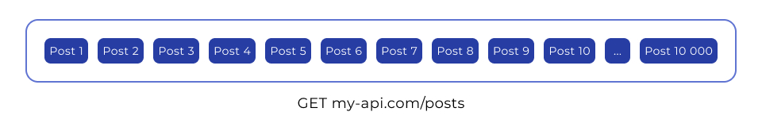
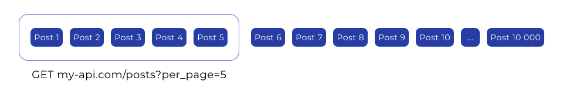
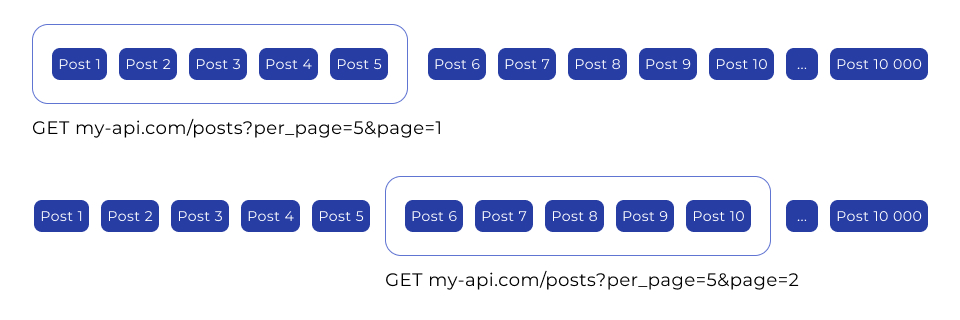

# Синтаксис async/await. Пагінація

###### [to main page](../js_main.md)

## Бібліотека Axios

### Встановлення

Бібліотека Axios — це простий HTTP-клієнт, що базується на Promise і автоматизує
багато рутинних завдань при роботі з HTTP-запитами, а саме дозволяє:

-   зберігати глобальні налаштування, що будуть автоматично додаватися до всіх
    запитів
-   автоматично перетворювати дані запиту у формат JSON
-   парсити дані відповіді з формату JSON
-   обробляти всі можливі помилки запиту, включаючи 404, та багато іншого.

Axios є зручною альтернативою стандартному Fetch API.

Для встановлення Axios як бібліотеки скористайся NPM:

```js
npm install axios
```

Для використання додай імпорт за замовчуванням у своєму JavaScript-файлі, у
якому ти плануєш використовувати Axios.

```js
import axios from 'axios';
```

### Синтаксис запиту

Запити можна робити, викликавши `axios` і передаючи відповідний об'єкт
конфігурації. Напишемо код, який виконує GET-запит.

```js
import axios from 'axios';

axios({
    method: 'get',
    url: '<https://jsonplaceholder.typicode.com/users>',
});
```

Після виконання функції `axios` ми отримуємо проміс, який обробляємо
стандартними методами `then` і `catch`.

```js
import axios from 'axios';

axios({
    method: 'get',
    url: '<https://jsonplaceholder.typicode.com/users>',
})
    .then(response => console.log(response))
    .catch(error => console.log(error));
```

### Псевдоніми методів запиту

У бібліотеці Axios існують псевдоніми (однойменні методи) для всіх підтримуваних
методів запиту, які спрощують синтаксис запиту та додають стандартні
налаштування.

Візьмемо вже відомий нам код GET-запиту.

```js
import axios from 'axios';

axios({
    method: 'get',
    url: '<https://jsonplaceholder.typicode.com/users>',
})
    .then(response => console.log(response))
    .catch(error => console.log(error));
```

Метод `axios.get(url[, config])` є спрощеним способом виконання GET-запиту.

Квадратні дужки позначають необов'язковий аргумент у документації і не є
частиною коду.

```js
import axios from 'axios';

axios
    .get('<https://jsonplaceholder.typicode.com/users>')
    .then(response => console.log(response))
    .catch(error => console.log(error));
```

Отже, метод `axios.get` потребує обов'язково лише адреси запиту, а метод GET
автоматично підставляється сам. Крім того, Axios додає до запиту стандартні
HTTP-заголовки, наприклад, `Accept`, у якому вказує `application/json`, оскільки
найчастіше ми очікуємо саме JSON від сервера.

### Об'єкт відповіді

Об'єкт відповіді на запит містить наступну інформацію.

```js
{
  data: {},
  status: 200,
  statusText: 'OK',
  headers: {},
  config: {},
  request: {}
}
```

-   `data` — відповідь, надана сервером
-   `status` — код стану HTTP з відповіді сервера
-   `statusText` — повідомлення про стан HTTP від відповіді сервера
-   `headers` — заголовки HTTP, з якими відповів сервер
-   `config` — конфігурація, яка була надана Axios для запиту
-   `request` — запит, який створив цю відповідь

У методі `then` ти отримаєш наступні властивості в об'єкті відповіді.

```js
import axios from 'axios';

axios
    .get('<https://jsonplaceholder.typicode.com/users>')
    .then(response => {
        console.log(response.data);
        console.log(response.status);
        console.log(response.statusText);
        console.log(response.headers);
        console.log(response.config);
    })
    .catch(error => {
        console.log(error);
    });
```

Зверни увагу, на властивість `data`, у якій зберігаються дані відповіді. На
відміну від fetch, нам не потрібно парсити дані відповіді методом
`response.json()`. Це робиться автоматично і додається до властивості `data`.
Крім того, не потрібно перевіряти статус відповіді у властивості `response.ok`.
Бібліотека Axios робить це автоматично і відхиляє проміс з помилкою для
будь-якого невдалого HTTP-коду відповіді, включаючи 404.

### Конфігурація за замовчуванням

Уяви ситуацію, коли в тебе є кілька запитів з однаковою базовою адресою сервера,
але до різних ресурсів. Розробнику доводиться повторювати базову адресу
(`https://jsonplaceholder.typicode.com`) у коді кожного запиту, що не дуже
зручно.

```js
axios.get('<https://jsonplaceholder.typicode.com/users>').then().catch();

axios.get('<https://jsonplaceholder.typicode.com/posts>').then().catch();

axios.get('<https://jsonplaceholder.typicode.com/images>').then().catch();
```

Можна вказати стандартні налаштування конфігурації у властивості
`axios.defaults`, які будуть застосовані до кожного запиту. Властивість
`axios.defaults.baseURL` відповідає за збереження базової адреси для всіх
HTTP-запитів.

```js
import axios from 'axios';

axios.defaults.baseURL = '<https://jsonplaceholder.typicode.com>';
```

Тепер код запитів можна переписати так, як ти бачиш у прикладі нижче — вказавши
лише частину адреси після базової. При виконанні запитів Axios автоматично
додасть значення `baseURL` до кожного запиту.

```js
import axios from 'axios';

axios.defaults.baseURL = '<https://jsonplaceholder.typicode.com>';

axios.get('/users').then().catch();

axios.get('/posts').then().catch();

axios.get('/images').then().catch();
```

### Заголовки за замовчуванням

Окрім базової адреси, можна також вказати необхідні стандартні заголовки запиту.
Наприклад, якщо у тебе є унікальний ключ API, який необхідно додавати до кожного
запиту у вигляді HTTP-заголовка, ти можеш додати його до властивості
`axios.defaults.headers.common`.

```js
import axios from 'axios';

const myApiKey = 'secret-api-key-for-every-request';

axios.defaults.headers.common['header-name'] = myApiKey;
```

Замість рядка "header-name" вказуємо потрібну назву заголовка у вигляді рядка.

Іншими словами, ми буквально додаємо нову властивість із ключем "`header-name`"
до об'єкта `axios.defaults.headers.common`. Після цього Axios автоматично
додасть цей заголовок із вказаним значенням до кожного запиту.

### Параметри рядка запиту

Для додавання параметрів рядка запиту до запиту існує кілька способів.

1. Ти, звісно, можеш вказати їх у URL.

```js
axios.get('<https://jsonplaceholder.typicode.com/users?_limit=7&_sort=name>');
```

2. Або використати клас URLSearchParams.

```js
const searchParams = new URLSearchParams({
    _limit: 5,
    _sort: 'name',
});

axios.get(`https://jsonplaceholder.typicode.com/users?${searchParams}`);
```

3. Але Axios надає нам зручніший спосіб. В об'єкті конфігурації (параметр
   `config`) ти можеш вказати об'єкт параметрів у властивості `params`.

```js
axios.get('<https://jsonplaceholder.typicode.com/users>', {
    params: {
        _limit: 7,
        _sort: 'name',
    },
});
```

Axios використовує цей об'єкт, щоб за допомогою `URLSearchParams` додати рядок
запиту з параметрами до адреси.

## Синтаксис async/await

## Асинхронні функції

Синтаксис `async/await` — це зручний спосіб написання асинхронного коду, який
ззовні схожий на синхронний. Цей механізм був доданий до стандарту ECMAScript
2017 (ES8) і став дуже популярним серед розробників завдяки його зручності та
зрозумілості. Будь-яка функція може бути асинхронною.

Для оголошення асинхронної функції перед ключовим словом `function` додається
`async`.

```js
async function fetchData() {
    // ...
}
```

У функціональному виразі також перед ключовим словом `function` додається
`async`.

```js
const fetchData = async function () {
    // ...
};
```

Для оголошення асинхронної стрілкової функції перед списком параметрів додається
ключове слово `async`.

```js
const fetchData = async () => {
    // ...
};
```

Для оголошення асинхронного методу об'єкта `async` додається перед іменем
методу.

```js
const user = {
    async getUsername() {
        // ...
    },
};
```

Для оголошення асинхронного методу класу також використовується `async` перед
іменем методу.

```js
class User {
    async getUsername() {
        // ...
    }
}
```

### Значення, що повертається

В основі `async/await` лежать проміси, тому він не блокує основний потік
виконання програми. По суті, це сучасний спосіб роботи з промісами всередині
функції, і це є альтернативою конструкції `then/catch`.

Асинхронна функція завжди повертає проміс. Отже, будь-яке значення, що
повертається з функції, стане значенням проміса.

```js
const foo = async () => {
    return 5;
};

foo().then(value => {
    console.log(value); // 5
});
```

Якщо не вказувати значення для повернення, буде створений проміс зі значенням
`undefined`.

```js
const foo = async () => {
    // Не вказуємо значення для повернення
};

foo().then(value => {
    console.log(value); // undefined
});
```

### Оператор await

Всередині асинхронних функцій можна використовувати оператор `await`,
розмістивши його праворуч від будь-якого виразу, який повертає проміс.

```js
const foo = async () => {
    console.log('Before await');

    const promiseValue = await new Promise(resolve => {
        setTimeout(() => resolve(5), 2000);
    });

    console.log('After await', promiseValue);
};

foo(); // через 2 секунди виведеться в консоль  "After await" 5
```

Коли інтерпретатор зустрічає `await`, він призупиняє виконання функції і чекає,
доки не завершиться виконання промісу, який знаходиться праворуч від `await`.

Якщо проміс успішно завершується (виконується), то виконання функції
продовжується, і результат асинхронної операції стає доступним для використання.

У змінній `promiseValue` зберігається не сам проміс, а результат його виконання
— у прикладі це число 5. Це тому, що інтерпретатор призупиняє функцію foo, коли
зустрічає оператор `await`, і чекає, доки відповідний проміс завершить
виконання, а потім, коли результат доступний, він продовжує виконання функції,
записуючи результат у змінну.

Підсумуємо:

-   Оператор `await` можна використовувати тільки всередині асинхронних функцій
    (`async`).
-   `await` не може викоистовуватися без `async`, але `async` може
    використовуватися без `await`
-   Оператор `await` призупиняє виконання функції до завершення відповідного
    промісу (`fulfilled` або `rejected`).
-   Якщо проміс завершується успішно (`fulfilled`), оператор `await` повертає
    його значення.
-   Якщо проміс завершується з помилкою (`rejected`), оператор `await` генерує
    помилку.
-   Асинхронна функція завжди повертає проміс, отже, будь-яке значення, що
    повертається, стає значенням цього промісу.
-   Якщо не вказати значення для повернення, буде створений проміс зі значенням
    `undefined`.

### HTTP-запити

Використаємо синтаксис `async/await` при роботі з HTTP-запитами, щоб зробити код
більш читабельним.

Давай перепишемо функцію `fetchUsers`, використовуючи цей синтаксис.

```js
const fetchUsers = () => {
    axios.get('<https://jsonplaceholder.typicode.com/users>').then(response => {
        console.log(response.data);
    });
};
```

Щоб зробити її асинхронною, спочатку додаємо ключове слово `async`.

```js
const fetchUsers = async () => {
    // ...
};
```

Потім ми використовуємо оператор `await`, щоб зачекати завершення `axios.get` та
отримати об'єкт відповіді у змінну `response`.

```js
const fetchUsers = async () => {
    const response = await axios.get(
        '<https://jsonplaceholder.typicode.com/users>'
    );
    console.log(response.data);
};
```

Якщо результат HTTP-запиту потрібно використовувати в зовнішньому коді, просто
поверни його значення з асинхронної функції та оброби його в методі `then`.

```js
const fetchUsers = async () => {
    const response = await axios.get(
        '<https://jsonplaceholder.typicode.com/users>'
    );
    return response.data;
};

fetchUsers().then(users => console.log(users));
```

### Конструкція `try…catch`

Конструкція `try...catch` — це механізм обробки винятків. Ти можеш створити блок
коду у `try`, де виникнення помилок відстежується, і задати блок `catch`, де
можна обробити ці помилки.

```js
try {
    // Блок коду, де можуть виникати помилки
} catch (error) {
    // Блок коду для обробки помилок, що виникли у блоці try
}
```

Коли у блоці `try` виникає помилка (виключення), виконання коду у `try`
зупиняється, і контроль передається до блоку `catch`. Параметр `error`
представляє об'єкт помилки, в якому зазвичай міститься інформація про помилку,
така як повідомлення про помилку.

Цей механізм дозволяє гнучко обробляти помилки і приймати відповідні рішення. Ти
можеш продовжити виконання програми, обробивши помилку у блоці `catch`, або
повідомити користувачеві про помилку.

Розглянемо приклад: ми намагаємося поділити число на нуль, що призводить до
помилки. За допомогою `try...catch` можна перехопити цю помилку та вивести
повідомлення про неї.

```js
console.log('Before try...catch');

try {
    const result = 10 / 0;
    console.log(result); // Цей рядок не виконається через помилку
} catch (error) {
    // Обробимо помилку
    console.error(error.message);
}

console.log('After try...catch');
```

### Обробка помилок

Якщо результат асинхронної функції (проміс) **не використовується в зовнішньому
коді**, помилки оброблюються у самому тілі функції за допомогою конструкції
`try...catch`. Значення параметра `error` у блоці `catch` — це помилка, яку
генерує `await`, якщо проміс був відхилений.

```js
const fetchUsers = async () => {
    try {
        const response = await axios.get(
            '<https://jsonplaceholder.typicode.com/users>'
        );
        console.log(response.data);
    } catch (error) {
        console.log(error);
    }
};
```

Якщо результат асинхронної функції (проміс) використовується в зовнішньому коді,
тобто за межами інших асинхронних функцій, помилки оброблюються методом
`catch()` колбеку. Значення параметра `error` у методі `catch()` — це помилка,
яку генерує `await`, якщо проміс буде відхилений.

```js
const fetchUsers = async () => {
    const response = await axios.get(
        '<https://jsonplaceholder.typicode.com/users>'
    );
    return response.data;
};

fetchUsers()
    .then(users => console.log(users))
    .catch(error => console.log(error));
```

Якщо результат асинхронної функції використовується в іншій асинхронній функції,
помилки оброблюються конструкцією `try...catch`. Значення параметра `error` у
блоці `catch` представляє помилку, яку генерує `await`, якщо проміс буде
відхилений.

```js
const fetchUsers = async () => {
    const response = await axios.get(
        '<https://jsonplaceholder.typicode.com/users>'
    );
    return response.data;
};

const doStuff = async () => {
    try {
        const users = await fetchUsers();
        console.log(users);
    } catch (error) {
        console.log(error);
    }
};
doStuff();
```

## Пагінація

### Колекції та групи

База даних може зберігати колекції, що містять тисячі записів. Наприклад, у нас
є застосунок для перегляду постів. Чи доцільно виводити відразу всю колекцію
постів під час кожного запиту, адже вона може становити тисячі? Авжеж, ні.

Почнемо з того, що обробка такої великої кількості даних у відповіді і їх
відображення в інтерфейсі вимагає значних обчислювальних ресурсів пристрою, на
якому відкривається вебсторінка. Розмір відповіді може бути настільки великим,
що час на отримання відповіді триватиме декілька секунд. Адже чим більше даних у
відповіді від сервера, тим триваліше вона передається по мережі. Крім того,
зазвичай користувачі не потребують бачити всі результати одночасно.

Отже, виводити всю колекцію при кожному GET-запиті є занадто витратним з погляду
ресурсів.

Розглянемо більш детально ситуацію, де наш сервер **`my-api.com`** зберігає
колекцію постів у ресурсі **`/posts`**. Колекції можуть бути дуже великими.

Для зручності сприйняття у прикладі ми розберемо 12 постів, але їх може бути
кілька тисяч.



Повернення колекції з усіх постів буде ресурсозатратним не тільки для браузера,
але й для сервера, що призводитиме до затримок під час обміну даними між ними.

Для розв’язання цих проблем існує практика використання пагінації.

**Пагінація** передбачає, що сервер повертає не всю колекцію, а лише певну
частину записів при кожному GET-запиті. Пагінацію реалізують на сервері та
використовують її на клієнтському боці завдяки спеціальним параметрам у запиті.

Для прикладу роботи з колекцією даних ми використовуємо публічний
JSONPlaceholder API та отримуємо масив постів з ендпоінта `/posts`.

```js
const fetchPosts = async () => {
    const response = await axios.get(
        '<https://jsonplaceholder.typicode.com/posts>'
    );
    console.log('Posts: ', response.data);
};
```

### Кількість елементів у відповіді

Перший параметр визначає кількість елементів у відповіді від сервера.

У нашому випадку цей параметр називається `per_page`. Стандартні назви
параметрів пагінації не існують, тому їхні імена залежать від розробника
серверної частини.



Під час такого GET-запиту сервер повертає не всю колекцію з 12 елементів, а лише
перші 4. Якщо передати від'ємне значення або значення, більше за кількість
елементів у колекції, то сервер може відреагувати по-різному. Залежно від
реалізації, сервер може:

-   проігнорувати їх
-   повернути помилку `400` (BAD REQUEST)

Також публічний JSONPlaceholder API підтримує пагінацію. Кількість елементів у
відповіді контролюється параметром `_limit`.

```js
const fetchPosts = async () => {
    const response = await axios.get(
        '<https://jsonplaceholder.typicode.com/posts?_limit=5>'
    );
    console.log('Posts: ', response.data);
};
```

### Номер групи елементів

Встановивши бажану кількість елементів у відповіді, ми завжди отримаємо
однаковий результат: перші `per_page` елементів колекції, так звану першу групу
або «сторінку».

Другий параметр пагінації контролює зміщення всередині колекції, тобто номер
групи елементів, яку ми хочемо отримати. Якщо сервер реалізує пагінацію, то
значення цього параметра за замовчуванням дорівнює одиниці — перша група або
«сторінка» елементів. У нашому прикладі він називається `page`.



Змінюючи значення параметра `page`, ми уточнюємо серверу, яку наступну групу
елементів ми хочемо отримати, і так продовжуємо, доки в колекції не закінчаться
елементи. Якщо вказати від'ємне значення або значення, більше за кількість груп
у колекції, відповідь сервера залежить від його реалізації.

У JSONPlaceholder API параметр, що контролює групу елементів, називається
`_page`.

```js
const fetchPosts = async () => {
    const response = await axios.get(
        '<https://jsonplaceholder.typicode.com/posts?_limit=5&_page=3>'
    );
    console.log('Posts: ', response.data);
};
```

Щоб визначити, коли елементи в колекції закінчаться, і вивести користувачу
повідомлення про це, сервер може повертати не тільки масив елементів, але й:

-   метадані про доступну кількість груп, що залежить від значення параметра
    `per_page`,

або

-   просто загальну кількість елементів у колекції.

У цьому випадку обчислення кількості груп залишається на плечах розробника
фронтенда. На жаль, **JSONPlaceholder** API не надає цю інформацію.
